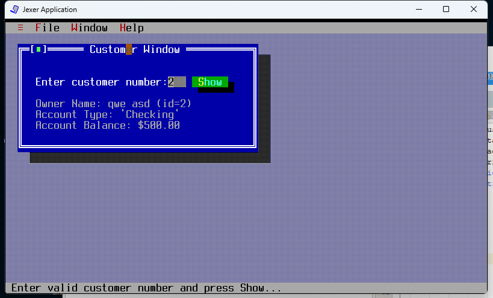

# UI Lab 1

## На "трійку"

1. Завантажте jar-файл Jexer з [cайту проекту](https://sourceforge.net/projects/jexer/files/latest/download) або з [цього ж репозиторію](https://github.com/liketaurus/TUI-Labs/blob/master/jars/jexer-0.3.0.jar)
2. Створіть в Netbeans новий проект з назвою TUIdemo. *УВАГА! Чекбокс *Create Main Class* треба **очистити** (**не створювати виконуваний клас**)!*
3. Додайте до проекту бібліотеку Jexer - правою кнопкой на проекті, обрати *Properties*, потім у дереві категорій обрати *Libraries* (другий пункт зверху), натиснути у правій частині вікна кнопку *Add JAR/Folder*, обрати jar-файл, завантажений у п. 1, натиснути *Ok*
4. Додайте до проекту файл **[TUIdemo.java](https://github.com/liketaurus/TUI-Labs/blob/master/Lab%201%20-TUI/TUIdemo.java)** з цього репозиторію
5. Вивчіть вихідний код у файлі, впевніться, що ви розумієте як він має працювати
6. Запустіть проект

результат

## На "чотири"
1. Перепишіть метод **ShowCustomerDetails** з використанням класів *Bank, Customer, Account* та ін. з наших попередніх лаб - банк повинен мати як мінімум два клієнти, інформацію про яких (та про перші рахунки, що їм належать) ви маєте побачити, увівши номер клієнта. *УВАГА! Класи можна взяти або з [відповідного репозиторію](https://github.com/liketaurus/OOP-JAVA), або взяти [jar-файл](https://github.com/liketaurus/TUI-Labs/blob/master/jars/MyBank.jar) з усіма необхідними класами з цього ж репозиторію та підключити його як бібліотеку (див. п.3 завдання "на трійку).*
2. Запустіть проект, впевніться, що все працює як очікувалось. Продемонстрируйте результат викладачеві.

Результат

